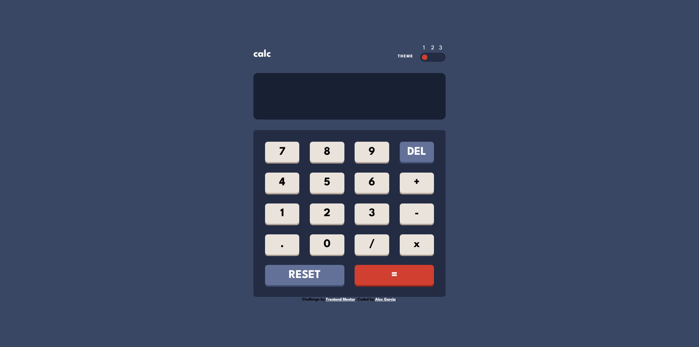
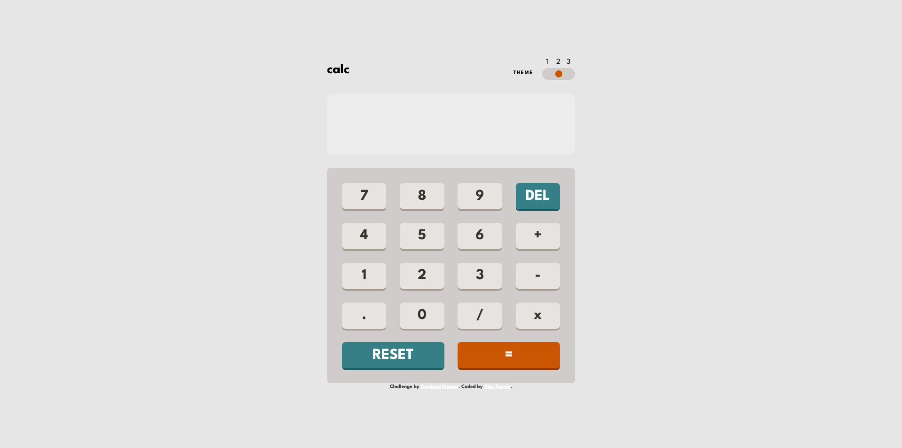
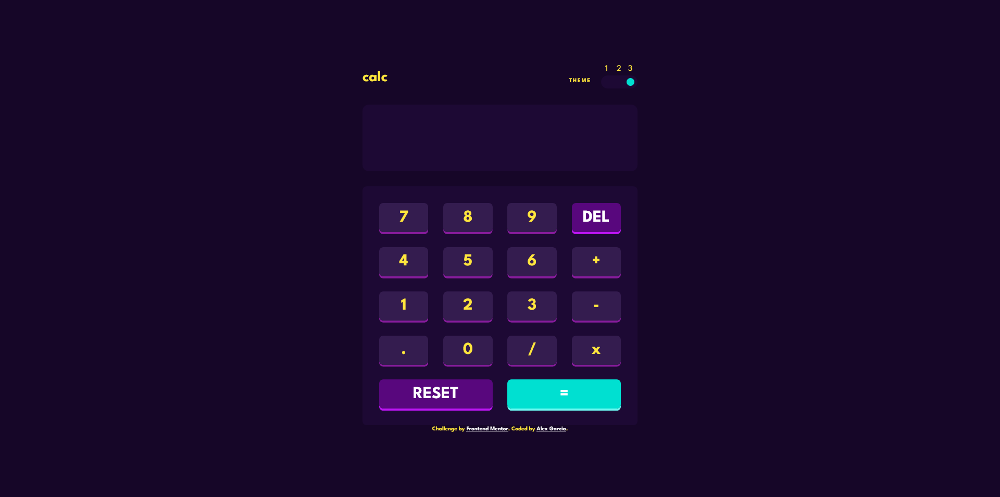

# Frontend Mentor - Calculator app solution

This is a solution to the [Calculator app challenge on Frontend Mentor](https://www.frontendmentor.io/challenges/calculator-app-9lteq5N29). Frontend Mentor challenges help you improve your coding skills by building realistic projects. 

## Table of contents

- [Overview](#overview)
  - [The challenge](#the-challenge)
  - [Screenshot](#screenshot)
  - [Links](#links)
- [My process](#my-process)
  - [Personal Objectives](#Personal-objectives-for-this-challenges)
  - [Built with](#built-with)
  - [What I learned](#what-i-learned)
  - [Useful resources](#useful-resources)
- [TO DO](#TO-DO)
- [Author](#author)

**Note: Delete this note and update the table of contents based on what sections you keep.**

## Overview

### The challenge

Users should be able to:

- See the size of the elements adjust based on their device's screen size
- Perform mathmatical operations like addition, subtraction, multiplication, and division
- Adjust the color theme based on their preference
- **Bonus**: Have their initial theme preference checked using `prefers-color-scheme` and have any additional changes saved in the browser

### Screenshot

### Links

- Solution URL: [Add solution URL here](https://your-solution-url.com)
- Live Site URL: [Add live site URL here](https://your-live-site-url.com)

## My process

### Personal objectives for this challenges
- use sass
- learn to use grid ( for the buttons)
- learn to use mixins for responsive(media queries)

### Built with
- html
- javascript
- Sass
- Flexbox
- CSS Grid
- [Normalize scss](https://github.com/kristerkari/normalize.scss) - sass version of Normalize

### What I learned

- use of grid for keys matrix
- the use of data attributes to get all the keys easily
- the use of javascript class with ES6 sintax
- to name nested elements with BEM grandchild elements aproach (insted of chaining elements)
- click efect on button using box-shadow property
- use js as a module type, and the necesity of a web server for use this js as modules
- use of sass interpolation and variables for grandparent selector (https://codeburst.io/how-to-do-sass-grandparent-selectors-b8666dcaf961)
- to pass a sass variable to a css variable we need to use #{$sass-variable}    (https://github.com/sass/sass/issues/1128) 
                                                                                (https://sass-lang.com/documentation/breaking-changes/css-vars)
                                                                                (https://medium.com/@xzyfer/why-node-sass-broke-your-code-and-semver-1b3e409c57b9)
- Use box-sizing: border-box; so that the padding does not increase the size of the div

### Useful resources

- https://www.youtube.com/watch?v=j59qQ7YWLxw&ab_channel=WebDevSimplified (how to build a calculator with js)
- https://scalablecss.com/bem-nesting-grandchild-elements/ (what to do with nested elements in BEM)
- https://www.javascripttutorial.net/es6/javascript-class/#:~:text=A%20JavaScript%20class%20is%20a,classes%20are%20just%20special%20functions. (js classes)
- https://stackoverflow.com/questions/19030742/difference-between-innertext-innerhtml-and-value#:~:text=Both%20innerText%20and%20innerHTML%20return,content%20of%20the%20HTML%20element. (difference between innerHTML(innerHTML renders html code if its inside a string) and innerText(not render html code inside the string))
- https://www.youtube.com/watch?v=-3WV1CjeF10&list=PLUWqFDiirlsu5az5EIyxe8ZddyNO_kDuP&index=5&ab_channel=CoderCoder
- https://codepen.io/renddrew/pen/bRomab
- https://codepen.io/renddrew/pen/bRomab, https://www.youtube.com/watch?v=-3WV1CjeF10&list=PLUWqFDiirlsu5az5EIyxe8ZddyNO_kDuP&index=5&ab_channel=CoderCoder (change themes toggle)
- https://www.youtube.com/watch?v=1334bFDilgk&ab_channel=FrontDev

## TO DO
- remake the toggle button without the p tag inside the label

## Author

- Frontend Mentor - [@alexgcode](https://www.frontendmentor.io/profile/alexgcode)
- Linkedin - [@alexgcode](https://www.linkedin.com/in/alex-martin-garcia-farfan-96a901120/)

